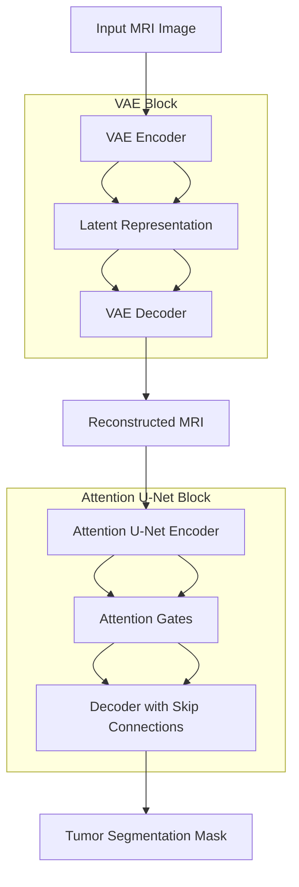

# Brain Tumor Segmentation using VAE + Attention U-Net

## Overview
This project presents a **hybrid deep learning model** for brain tumor segmentation using MRI scans by combining:

- Variational Autoencoder (VAE)
- Attention U-Net

The model integrates **generative learning + segmentation** to improve tumor detection.

---

## Objective
- Segment brain tumors from MRI images  
- Improve feature learning using VAE  
- Compare baseline and hybrid models  
- Evaluate using advanced segmentation metrics  

---

## Model Architecture

---
### Pipeline
      Input MRI Image
            ↓
    Variational Autoencoder (VAE)
            ↓
    (Feature Learning + Reconstruction)
            ↓
    Reconstructed MRI Image
            ↓
    Attention U-Net
    (Segmentation Model)
            ↓
    Tumor Segmentation Mask

---

## Models Used

| Model | Purpose |
|------|--------|
| Attention U-Net | Baseline segmentation |
| VAE | Feature extraction & denoising |
| VAE + Attention U-Net | Proposed hybrid model |

---

## Loss Function
    Total Loss = Reconstruction Loss (MSE) + KL Divergence + Dice Loss
- **MSE Loss** → reconstruction  
- **KL Divergence** → latent space regularization  
- **Dice Loss** → segmentation accuracy  

---

## Evaluation Metrics

- Dice Score  
- IoU (Intersection over Union)  
- Precision  
- Recall  
- F1 Score  
- ROC Curve (AUC)  

 Accuracy is not used due to class imbalance.

---

## Results

| Metric | Value |
|-------|------|
| Dice Score (Baseline) | 0.378 |
| Dice Score (Proposed) | 0.397 |
| IoU | 0.249 |
| Precision | 0.062 |
| Recall | 0.678 |
| F1 Score | 0.113 |
| AUC | 0.618 |

---

## Dataset

The datasets used in this project are publicly available:

- Brain Tumor MRI Dataset  
  https://www.kaggle.com/datasets/masoudnickparvar/brain-tumor-mri-dataset  

- Brain Tumor Classification MRI Dataset  
  https://www.kaggle.com/datasets/sartajbhuvaji/brain-tumor-classification-mri  

---

## Dataset Description

- MRI scans categorized into:
  - Glioma  
  - Meningioma  
  - Pituitary  
  - No tumor  

---

## Important Note on Dataset Usage

This project uses **cross-dataset training**:

- MRI images from classification dataset  
- Segmentation labels aligned using tumor categories  

---

## Dataset Structure
    DL/
    ├── Training/
    ├── Testing/

    DL-segmentation/
    ├── Training/
    ├── Testing/

---

## Tech Stack

- Python  
- PyTorch  
- Google Colab  
- NumPy  
- Matplotlib  
- Scikit-learn  

---

## Key Insights

- VAE improves feature learning  
- Attention U-Net focuses on tumor regions  
- Hybrid model improves Dice score  
- Low precision indicates over-segmentation  

---

## Conclusion

The hybrid VAE + Attention U-Net model demonstrates improved segmentation performance by combining generative and discriminative learning.
